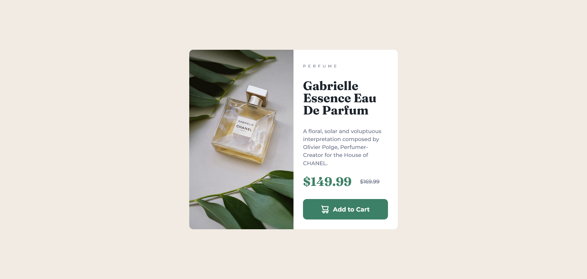

# Frontend Mentor - Product preview card component solution

This is a solution to the [Product preview card component challenge on Frontend Mentor](https://www.frontendmentor.io/challenges/product-preview-card-component-GO7UmttRfa). Frontend Mentor challenges help you improve your coding skills by building realistic projects.

## Table of contents

- [Overview](#overview)
  - [The challenge](#the-challenge)
  - [Screenshot](#screenshot)
  - [Links](#links)
- [My process](#my-process)
  - [Built with](#built-with)
  - [What I learned](#what-i-learned)
  - [Continued development](#continued-development)
  - [Useful resources](#useful-resources)
- [Author](#author)

## Overview

### The challenge

Users should be able to:

- View the optimal layout depending on their device's screen size
- See hover and focus states for interactive elements
- display different image for mobile and desktop devices
- maintain center even on portrait screen

### Screenshot

#### Desktop screenshot



#### Mobile screenshot


### Links

- Solution URL: [Github Repo](https://github.com/frontend-mentor-io/product-preview-card-component-solution)
- Live Site URL: [Github page](https://frontend-mentor-io.github.io/product-preview-card-component-solution/)

## My process

### Built with

- Semantic HTML5 markup
- CSS custom properties
- CSS Grid
- Mobile-first workflow
- [React](https://reactjs.org/) - JS library

### What I learned

use two images for the figure section image 1 for desktop device and image 2 for mobile devices
then toggling image display if the viewport is for desktop or mobile devices by using the

##### for mobile devices

```css
.card__image--mobile {
  display: block;
}

.card__image--desktop {
  display: none;
}
```

##### for desktop devices

```css
.card__image--desktop {
  display: block;
}

.card__image--mobile {
  display: none;
}
```

### Continued development

I want to focus on developing responsive websites

### Useful resources

- [multiple ways of adding image with react](https://codingstatus.com/how-to-display-images-in-react-js/) - this helps me to add image without placing it inside the public folder

- [different ways of adding css in react](https://dev.to/salehmubashar/3-ways-to-add-css-in-react-js-336f) - this helps me to add external stylesheet on my main page

## Author

- Github - [Neomill](https://github.com/Neomill)
- Frontend Mentor - [@neomill](https://www.frontendmentor.io/profile/Neomill)
- Gmail - [Neomill Marc Reas](rneomillmarc@gmail.com)
